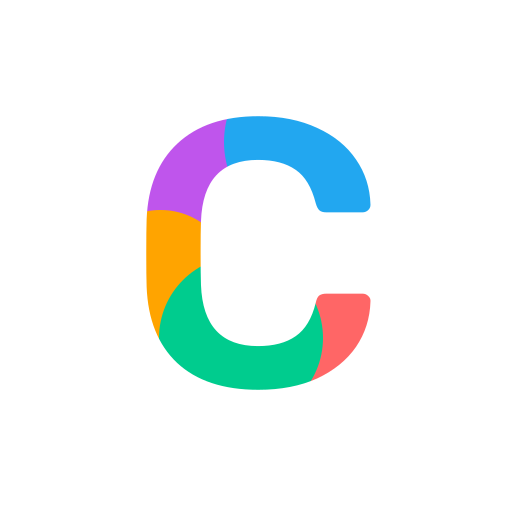

 <h1>  Web Searcher </h1>
 
 
 
 

# About

<h3>All the amazing colors & gradients you need just click and copy</h3>

### Website is Live : [colpic.netlify.app](https://colpic.netlify.app)

# Screensorts

   
   

# PageSpeed Insights

# Tech Used

# Contribute

**If you are Using NPM then:**

- **Step 1:** Fork and Download the Repository
- **Step 2:** Open it in editor like VSCode
- **Step 3:** Open Terminal inside it and run ` npm install` to install required dependencies (you can apply '--force' after command and then run it , incase you face any error)
- **Step 4:** Run `npm start` to launch the website on 'localhost:3000' and check if it is working without any error.
- **Step 5:** Do your Changes and make sure that you don't get any error or warning.
- **Step 6:** Push on github and Create a Pull Request

**Stuck? Search your issue/error on Google**

In Case you are not from Coding Background but still want to Contribute then You can add your favourite tool/app by filling form in contribution section of our [website](https://colpic.netlify.app)
